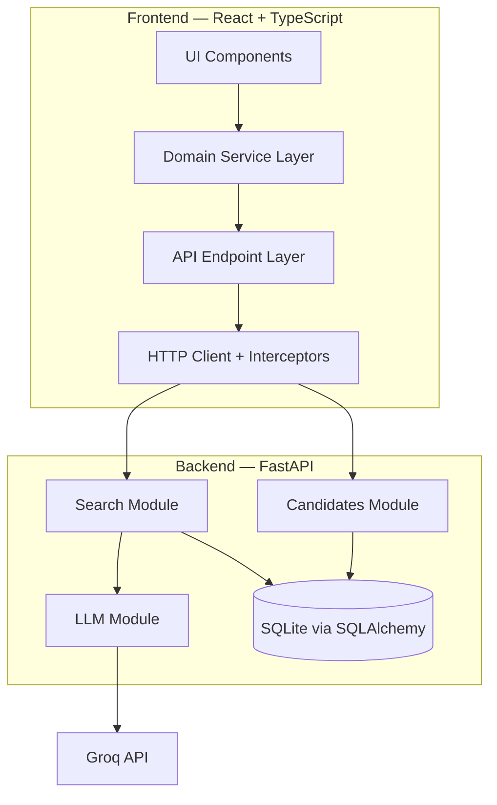
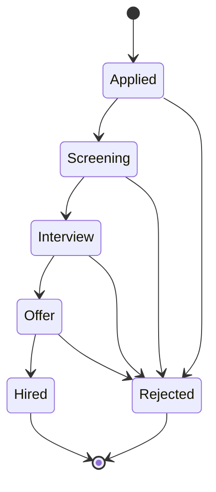

# Mini Hiring Pipeline

A single-job recruiter tool for managing candidates through a structured hiring pipeline. Recruiters can add candidates, track their progress through each stage, view a complete stage-transition history, and search the pipeline using natural language, including fuzzy name matching and time-based queries.

---

## Features

- **Add candidates** — name and email; candidates enter the pipeline at `Applied`
- **Pipeline view** — candidates grouped by stage in a kanban-style board with stage navigation and an all-columns view
- **Stage transitions** — candidates advance one stage at a time; invalid transitions and skipped stages are rejected by the backend
- **Reject candidates** — candidates can be rejected from any pre-terminal stage
- **Candidate detail drawer** — candidate profile and complete stage-transition history
- **Append-only stage-event history** — every transition is recorded as a `StageEvent`
- **Current-stage duration** — derived from the most recent stage event rather than stored as mutable data
- **Natural-language search** — recruiter queries are interpreted by Groq using structured JSON output
- **Fuzzy candidate-name matching** — tolerates name typos using RapidFuzz
- **Combined search conditions** — multiple search constraints can be expressed in one natural-language query
- **Historical search** — queries can inspect previous stage transitions, not only the candidate's current stage
- **Invalid-query explanation** — unsupported or nonsensical queries return an explanation instead of silently returning an empty result
- **Search result ranking** — exact and close name matches are ranked using deterministic application logic
- **Responsive recruiter UI** — React + TypeScript + Tailwind CSS
- **Keyboard navigation** — primary interactive UI flows are keyboard-navigable

---

## Pipeline

Candidates move through the following stages:

```text
Applied → Screening → Interview → Offer → Hired
```

A candidate can be rejected from any stage before reaching a terminal state:

```text
Applied   ──→ Rejected
Screening ──→ Rejected
Interview ──→ Rejected
Offer     ──→ Rejected
```

`Hired` and `Rejected` are terminal states.

The backend enforces the state machine, so clients cannot skip stages, reverse a transition, or transition a candidate after reaching a terminal state.

---

## Natural-Language Search

Recruiters can search the pipeline using plain English.

The backend sends the natural-language query to Groq. The LLM converts the query into a constrained `SearchQuery` object. The application then performs the actual filtering, history inspection, fuzzy matching, and ranking deterministically.

The LLM **does not generate or execute SQL** and never directly accesses the database.

### Example queries

| Query                                                   | What it resolves                                                     |
| ------------------------------------------------------- | -------------------------------------------------------------------- |
| `Find Priya Sharma`                                     | Name lookup with exact match preferred                               |
| `Find Priya Sharam`                                     | Fuzzy name matching can still return Priya Sharma                    |
| `Who's in Interview right now?`                         | `current_stage = Interview`                                          |
| `Who has been stuck in Screening for more than a week?` | `current_stage = Screening`, duration `> 7 days`                     |
| `Who moved to Interview since Monday?`                  | Stage history: `to_stage = Interview` since the resolved Monday date |
| `Who reached the Offer stage but didn't get hired?`     | Candidate reached `Offer` but has no `Hired` event                   |
| `Everyone except rejected candidates`                   | Excludes candidates whose current stage is `Rejected`                |

Search conditions can also be combined. For example:

```text
Candidates in Screening for more than three days, excluding rejected ones
```

The search parser converts this into structured conditions, after which the backend applies the conditions deterministically.

### Unsupported queries

Nonsensical or unsupported queries do not silently become empty searches.

For example:

```text
What's the weather?
```

is interpreted as:

```json
{
  "query_type": "invalid",
  "explanation": "..."
}
```

The API returns the explanation so the UI can tell the recruiter why the query could not be handled.

---

## Architecture



### Frontend layer

The frontend uses a centralized request flow:

```text
Component
    ↓
candidate.service.ts
    ↓
candidate.api.ts
    ↓
apiClient
    ↓
interceptors
    ↓
FastAPI
```

The same API layer also exposes the natural-language search endpoint:

```text
SearchSection.tsx
    ↓
candidateService.search(...)
    ↓
candidateApi.search(...)
    ↓
apiClient.post("/search", ...)
    ↓
FastAPI /search
```

The frontend does not make direct `fetch` calls from components.

Responsibilities are separated as follows:

- **Components** — UI rendering, user interaction, and local UI state
- **Service layer** — domain-level candidate operations
- **API layer** — backend endpoint definitions
- **HTTP client** — shared HTTP communication
- **Interceptors** — centralized request/response handling
- **Types** — shared TypeScript contracts
- **Utils** — presentation and stage/date-related utilities

The backend URL is configured through the frontend environment variable rather than hardcoded in components.

### Backend layer

The backend is organized into domain-oriented modules under `backend/app/`:

| Module        | Responsibility                                                            |
| ------------- | ------------------------------------------------------------------------- |
| `candidates/` | Candidate operations, state machine, schemas, and stage history           |
| `search/`     | Search parsing, Pydantic validation, deterministic filtering, and ranking |
| `llm/`        | Groq client and LLM prompt construction                                   |
| `database/`   | SQLAlchemy engine and session factory                                     |
| `config/`     | Environment variable loading through `pydantic-settings`                  |

---

## Structured LLM Output

The LLM is used as a **query-intent parser**, not as the search executor.

The Groq client requests JSON output explicitly:

```python
response = self.client.chat.completions.create(
    model=self.model,
    temperature=0,
    response_format={"type": "json_object"},
    messages=[
        {"role": "system", "content": system_prompt},
        {"role": "user", "content": user_prompt},
    ],
)
```

This is a deliberate engineering choice.

### Why JSON response mode?

The search parser has a defined application contract. Instead of accepting arbitrary natural-language output from the LLM, the model is asked to return a JSON object representing the user's search intent.

The application then validates that object with Pydantic:

```text
User query
    ↓
Groq
    ↓
JSON object
    ↓
Pydantic SearchQuery validation
    ↓
Deterministic search service
    ↓
Ranked results
```

The important distinction is:

> JSON response mode constrains the response to a JSON object; it does not guarantee that the model interpreted the user's intent correctly.

Pydantic validates the structure and allowed values. The deterministic search service is responsible for actually executing the search.

This creates an explicit boundary between probabilistic language interpretation and deterministic application logic.

---

## Why the LLM Does Not Generate SQL

A simpler architecture could have been:

```text
Natural language
      ↓
     LLM
      ↓
     SQL
      ↓
   Database
```

Instead, this project uses:

```text
Natural language
      ↓
     LLM
      ↓
 SearchQuery struct
      ↓
Deterministic search service
      ↓
   Database
```

For example:

```text
Who has been stuck in Screening for more than a week?
```

is converted into a constrained representation similar to:

```json
{
  "query_type": "candidate_search",
  "current_stage": "Screening",
  "stage_duration_operator": "gt",
  "stage_duration_days": 7
}
```

The backend then evaluates those conditions against candidate and stage-event data.

### Reasons for this approach

- Reduces model authority over database operations
- Makes the supported search space explicit and bounded
- Allows Pydantic to validate the LLM output before execution
- Keeps business logic deterministic and reviewable
- Makes unsupported queries easier to explain
- Decouples database implementation from LLM-generated text
- Prevents arbitrary model-generated SQL from being executed

This does not eliminate semantic LLM errors. The model can still misunderstand a natural-language query. However, the execution path after parsing remains under application control.

---

## Where I Disagreed With AI

During development, direct LLM-generated SQL was considered as an alternative:

```text
Natural language → LLM → SQL → Database
```

The implementation deliberately uses a constrained intermediate representation:

```text
Natural language
      ↓
     LLM
      ↓
 SearchQuery
      ↓
Deterministic search service
      ↓
   Database
```

The reason for this decision is that direct SQL generation gives the model unnecessary authority over database operations, makes validation more difficult, couples LLM output to the database schema, and makes unsupported queries harder to handle cleanly.

Using a constrained `SearchQuery` object keeps the supported search capabilities explicit and testable.

---

## Data Model

### Candidate

| Field           | Type     | Notes                  |
| --------------- | -------- | ---------------------- |
| `id`            | integer  | Primary key            |
| `name`          | string   | Required               |
| `email`         | string   | Required and unique    |
| `current_stage` | string   | Current pipeline stage |
| `created_at`    | datetime | Stored as UTC          |

### StageEvent

| Field          | Type          | Notes                                            |
| -------------- | ------------- | ------------------------------------------------ |
| `id`           | integer       | Primary key                                      |
| `candidate_id` | integer       | Foreign key to `Candidate`                       |
| `from_stage`   | string / null | Previous stage; null for initial `Applied` event |
| `to_stage`     | string        | New stage                                        |
| `occurred_at`  | datetime      | Stored as UTC                                    |

Every stage transition creates a `StageEvent`, including the initial entry into `Applied`.

Current-stage duration is derived from the timestamp of the latest stage event rather than stored separately. This avoids maintaining a mutable duration field that could become stale.

---

## Candidate State Machine



The backend validates every forward transition against the `NEXT_STAGE` map.

Examples:

```text
Applied → Screening       valid
Screening → Interview     valid
Interview → Offer         valid
Offer → Hired             valid

Applied → Interview       rejected
Screening → Offer         rejected
Offer → Screening         rejected
Hired → anything          rejected
Rejected → anything       rejected
```

Invalid transitions return `HTTP 400`.

---

## Audit Trail

Every stage transition creates a `StageEvent` containing:

- `from_stage` — stage before the transition
- `to_stage` — stage after the transition
- `occurred_at` — UTC timestamp

The stage history is **application-level append-only**.

There is currently no API endpoint that modifies or deletes stage events.

The database itself does not enforce immutability through database triggers, row-level security, or similar mechanisms. Therefore, the implementation deliberately describes this as application-level append-only history rather than database-enforced immutability.

Candidate current state is stored separately on `Candidate` for efficient current-stage queries, while historical movement is reconstructed from `StageEvent` records.

This historical data is also used by the search system.

For example:

```text
Who reached Offer but wasn't hired?
```

requires inspecting stage history rather than looking only at `current_stage`.

---

## Fuzzy Name Matching

Name searches use RapidFuzz's character-similarity matching.

The current scoring strategy is:

| Condition                              |                      Score |
| -------------------------------------- | -------------------------: |
| Exact case-insensitive match           |                    `100.0` |
| Query is a substring of candidate name |                     `95.0` |
| Otherwise                              | RapidFuzz similarity ratio |

Candidates below the current similarity threshold of `55` are excluded.

Results are sorted by:

1. Descending name match score
2. Candidate name alphabetically

The frontend does not re-rank search results.

This allows a query such as:

```text
Find Priya Sharam
```

to match:

```text
Priya Sharma
```

while still preferring an exact match when one exists.

---

## API Reference

### Health

| Method | Path      | Description               |
| ------ | --------- | ------------------------- |
| `GET`  | `/health` | Returns API health status |

Example:

```json
{
  "status": "ok"
}
```

### Candidates

| Method | Path                          | Description                                  |
| ------ | ----------------------------- | -------------------------------------------- |
| `POST` | `/candidates`                 | Create a candidate; starts at `Applied`      |
| `GET`  | `/candidates`                 | List all candidates                          |
| `GET`  | `/candidates/{id}`            | Candidate details and complete stage history |
| `POST` | `/candidates/{id}/transition` | Advance to the next stage                    |
| `POST` | `/candidates/{id}/reject`     | Reject the candidate                         |

#### Create candidate

`POST /candidates`

```json
{
  "name": "Priya Sharma",
  "email": "priya@example.com"
}
```

#### Transition candidate

`POST /candidates/{id}/transition`

```json
{
  "target_stage": "Screening"
}
```

### Search

`POST /search`

Request:

```json
{
  "query": "Who's in Interview right now?"
}
```

The response contains:

- Original query
- Parsed `SearchQuery`
- Matching candidates
- Match score
- Current-stage duration
- Total result count

Example response shape:

```json
{
  "query": "Who's in Interview right now?",
  "interpreted_query": {
    "query_type": "candidate_search",
    "current_stage": "Interview"
  },
  "results": [
    {
      "id": 1,
      "name": "Priya Sharma",
      "email": "priya@example.com",
      "current_stage": "Interview",
      "created_at": "...",
      "current_stage_since": "...",
      "current_stage_duration_days": 2,
      "match_score": 100.0
    }
  ],
  "total": 1
}
```

---

## Technology Stack

| Layer                   | Technology                   |
| ----------------------- | ---------------------------- |
| Frontend                | React + TypeScript           |
| Styling                 | Tailwind CSS                 |
| Build tool              | Vite                         |
| Backend                 | FastAPI                      |
| Backend language        | Python                       |
| ORM                     | SQLAlchemy                   |
| Validation              | Pydantic / pydantic-settings |
| Database                | SQLite                       |
| LLM provider            | Groq                         |
| Fuzzy matching          | RapidFuzz                    |
| Backend package manager | uv                           |

Exact dependency versions are defined by the project's package manifests.

---

## Project Structure

```text
mini-hiring-pipeline/
│
├── backend/
│   ├── app/
│   │   ├── candidates/
│   │   │   ├── __init__.py
│   │   │   ├── constants.py
│   │   │   ├── models.py
│   │   │   ├── router.py
│   │   │   ├── schemas.py
│   │   │   └── service.py
│   │   │
│   │   ├── search/
│   │   │   ├── __init__.py
│   │   │   ├── parser.py
│   │   │   ├── ranking.py
│   │   │   ├── router.py
│   │   │   ├── schemas.py
│   │   │   └── service.py
│   │   │
│   │   ├── llm/
│   │   │   ├── __init__.py
│   │   │   ├── client.py
│   │   │   └── prompts.py
│   │   │
│   │   ├── database/
│   │   │   ├── __init__.py
│   │   │   └── connection.py
│   │   │
│   │   ├── config/
│   │   │   ├── __init__.py
│   │   │   └── settings.py
│   │   │
│   │   └── main.py
│   │
│   ├── pyproject.toml
│   ├── uv.lock
│   └── .env
│
├── frontend/
│   ├── src/
│   │   ├── api/
│   │   │   ├── candidate.api.ts
│   │   │   ├── client.ts
│   │   │   └── interceptors.ts
│   │   │
│   │   ├── services/
│   │   │   └── candidate.service.ts
│   │   │
│   │   ├── components/
│   │   │   ├── candidates/
│   │   │   │   ├── AddCandidateModal.tsx
│   │   │   │   ├── CandidateCard.tsx
│   │   │   │   ├── CandidateColumn.tsx
│   │   │   │   ├── CandidateDetailDrawer.tsx
│   │   │   │   ├── CandidateHistory.tsx
│   │   │   │   ├── CandidatePipeline.tsx
│   │   │   │   ├── CandidateSkeleton.tsx
│   │   │   │   ├── CandidatesPage.tsx
│   │   │   │   └── SearchSection.tsx
│   │   │   │
│   │   │   ├── common/
│   │   │   │   ├── Badge.tsx
│   │   │   │   ├── Icons.tsx
│   │   │   │   └── Toast.tsx
│   │   │   │
│   │   │   └── layout/
│   │   │       └── AppHeader.tsx
│   │   │
│   │   ├── types/
│   │   │   ├── candidate.types.ts
│   │   │   └── search.types.ts
│   │   │
│   │   ├── utils/
│   │   │   ├── date.utils.ts
│   │   │   └── stage.utils.ts
│   │   │
│   │   ├── App.tsx
│   │   ├── index.css
│   │   └── main.tsx
│   │
│   ├── package.json
│   └── .env
│
└── README.md
```

---

## Getting Started

### Prerequisites

Install:

- Node.js
- Python
- uv
- A Groq API key

Use the versions supported by the project's current package manifests.

### Backend

```bash
cd backend
uv sync
```

Create `backend/.env`:

```dotenv
GROQ_API_KEY=your_groq_api_key_here
GROQ_MODEL=openai/gpt-oss-120b
```

Start the backend:

```bash
uv run uvicorn app.main:app --reload
```

The API will be available at:

```text
http://127.0.0.1:8000
```

The SQLite database is created automatically when the application starts.

### Frontend

Open another terminal:

```bash
cd frontend
npm install
```

Create `frontend/.env`:

```dotenv
VITE_API_BASE_URL=http://127.0.0.1:8000
```

Start the development server:

```bash
npm run dev
```

The frontend will be available at the Vite development URL shown by the terminal, normally:

```text
http://localhost:5173
```

---

## Environment Variables

### Backend

`backend/.env`

```dotenv
GROQ_API_KEY=your_groq_api_key_here
GROQ_MODEL=openai/gpt-oss-120b
```

| Variable       | Description                                   |
| -------------- | --------------------------------------------- |
| `GROQ_API_KEY` | API key used for LLM requests                 |
| `GROQ_MODEL`   | Groq model used for structured search parsing |

The selected model must support the JSON response mode used by the application.

### Frontend

`frontend/.env`

```dotenv
VITE_API_BASE_URL=http://127.0.0.1:8000
```

| Variable            | Description                     |
| ------------------- | ------------------------------- |
| `VITE_API_BASE_URL` | Base URL of the FastAPI backend |

Environment files containing secrets should not be committed to source control.

---

## Key Engineering Decisions

### 1. Domain-oriented backend structure

`candidates/`, `search/`, and `llm/` have separate responsibilities and boundaries.

This keeps candidate lifecycle logic independent from natural-language search and LLM integration.

### 2. Backend-enforced state machine

The allowed next stages are defined centrally through the `NEXT_STAGE` mapping and terminal stages are explicitly defined.

Transition validation occurs in the backend service layer rather than relying on frontend controls.

The frontend therefore cannot bypass the backend's transition rules.

### 3. Application-level append-only stage history

Every stage transition creates a `StageEvent`.

No API endpoint modifies or deletes stage events.

The current implementation intentionally describes this as application-level append-only history; database-level immutability is a future production consideration.

### 4. Derived current-stage duration

Current-stage duration is calculated from the timestamp of the latest `StageEvent` rather than stored as a mutable field.

This prevents stale derived state.

### 5. LLM → structured `SearchQuery`, not LLM → SQL

The LLM is restricted to interpreting natural language into a constrained application-level representation.

The backend remains responsible for search execution.

### 6. Groq JSON response mode

The Groq request explicitly uses:

```python
response_format={"type": "json_object"}
```

This establishes a structured response boundary between the LLM and the application.

### 7. `temperature=0`

The search parser uses `temperature=0` to make model output as deterministic as possible for this constrained interpretation task.

### 8. Pydantic validation of LLM output

The raw JSON object is validated through:

```python
SearchQuery.model_validate(raw_result)
```

Invalid structures are rejected before reaching the search service.

### 9. RapidFuzz for name matching

Name matching uses deterministic fuzzy similarity scoring after the LLM has identified that the query contains a candidate-name condition.

The frontend does not perform its own ranking.

### 10. Single-job scope

The assessment specifies a recruiter managing candidates for one job.

Therefore, the implementation intentionally does not introduce a `Job` entity or multi-job routing.

---

## Scope

This application is intentionally scoped to a **single job**.

There is no multi-job or multi-recruiter data model because those capabilities are outside the stated assessment scope.

Features such as:

- Job posting management
- Multiple hiring pipelines
- Interview scheduling
- Offer negotiation
- Recruiter authentication and authorization

are outside the current implementation scope.

---

## Security and Production Considerations

Authentication and authorization are not implemented because they are not required by the assessment's single-recruiter, single-job scope.

For a production deployment, the system would need:

- Authentication
- Role-based access control
- Database-level protection for audit history
- Production database infrastructure
- Secrets management
- Rate limiting
- Structured logging and monitoring
- Stronger API validation and operational controls

These are deliberately not added solely to increase the assessment scope.

---

## What I Would Do With More Time

1. **Automated test coverage**

   Add unit and integration tests covering every state-transition rule and a curated natural-language query suite.

2. **Database migrations**

   Introduce Alembic migrations instead of relying on `Base.metadata.create_all()` for schema evolution.

3. **Authentication and RBAC**

   Add users, authentication, recruiter authorization, and role-based access controls for a multi-user production system.

4. **Database-level audit protection**

   Add database mechanisms such as triggers or appropriate database-level permissions if stronger audit immutability is required.

5. **LLM failure handling**

   Add graceful handling for LLM provider failures, including retries, circuit breaking, and potentially a deterministic fallback for supported search patterns.

6. **Timezone handling**

   Keep storage in UTC while making timezone interpretation explicit for recruiter-facing relative queries such as "since Monday".

7. **Search performance**

   The current implementation loads candidates and evaluates search conditions in application code. For larger datasets, frequently queried conditions should be pushed into SQL with appropriate indexes.

8. **Production observability**

   Add structured logs, request tracing, metrics, and error monitoring.

---

## AI-Assisted Development

AI tools were used during development for:

- Implementation assistance
- UI component development
- LLM prompt design
- Code review

AI-generated suggestions were evaluated against the assessment requirements and the application's actual implementation.

A notable architectural decision made during development was to avoid LLM-generated SQL and instead use a constrained `SearchQuery` representation followed by deterministic backend execution.

The use of Groq's JSON response mode, Pydantic validation, and an application-level append-only stage history were also deliberate engineering decisions rather than assumptions that the LLM should control the application architecture.

---

## Current Limitations

The current implementation is intentionally assessment-focused.

Known limitations include:

- No authentication or authorization
- SQLite is used as the application database
- No database migration framework
- No database-level audit immutability
- Search filtering currently operates in application code
- Search depends on the configured Groq model
- No production-grade observability
- No production deployment configuration

These limitations are documented explicitly rather than hiding functionality that was not required for the assessment.

---

## Summary

The application demonstrates a complete single-job hiring workflow with:

```text
Candidate Management
        +
Backend-Enforced State Machine
        +
Append-Only Stage History
        +
Natural-Language Search
        +
Structured LLM Output
        +
Deterministic Search Execution
        +
Fuzzy Name Matching
        +
Centralized Frontend API Architecture
```

The central design principle is to use the LLM where language understanding is needed while keeping business rules, database access, state transitions, and search execution under deterministic application control.
